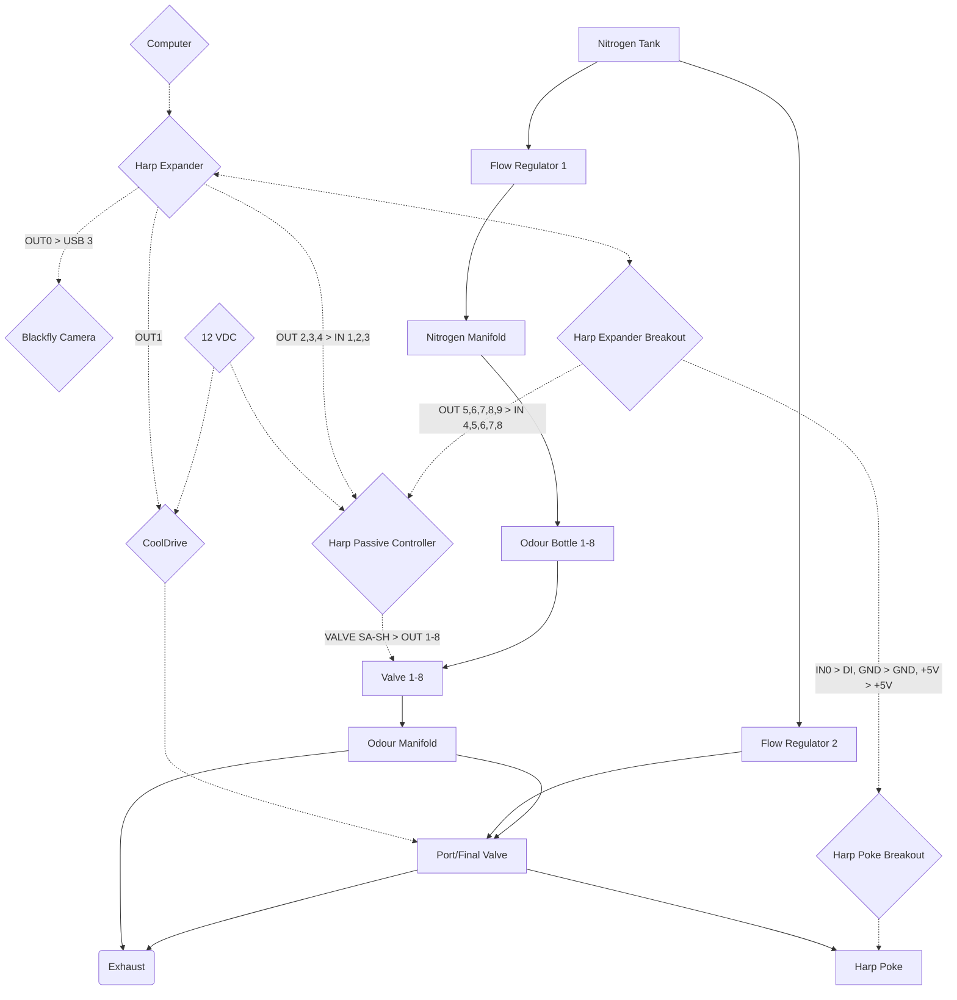

**HARDWARE**
- Mouse in home cage
- 1x Harp poke in the wall of the cage
- 1x Harp expander + breakout board
- 1x Harp passive Voltage step-up board (8 channels)
- 1x FLIR Blackfly camera (part # BFS-U3-13Y3M-C), 8-pin GPIO + IR source
- 8x 3-way “stimulus” valves (VALVE_Sx) to control which stimulus is administered; these valves upstream of the “poke” valve
- 1x 4-way “poke” valve (VALVE_p) feeding into the poke that controls onset and offset of the stimulus (by default flows odorless air, when energized  flows odorized air; which odor it flow is determined by the “stimulus” valves upstream)
 
**HARDWARE TESTING WORKFLOW**
- See [Wiring diagram for hardware](https://github.com/goatsofnaxos/Delphi/blob/main/Design/WiringDiagram.pdf)
- Goal: control the state of all valves + camera trigger as well as simulate IR beam breaks on the poke
- Graphical interface
	- Black background
	- 8 grey/white square for the 8 VALVE_Sx valves, with text above it indicating "stimulus" name ("OdorA/OdorB/...") and line ID ("outX")
	- 1 (separate, standalone) grey/white square for the VALVE_P valve, with text above indicating name ("VALVE_P") and line ID ("out1")
	- 1 (separate, standalone) grey/white circle for the poke IR beam state
	- 1 (separate, standalone) grey/white triangle for camera trigger state
	- Color convention: GREY when line is low / WHITE when line is high
	- Interaction:
		- Clicking a square or triangle (valves and camera trigger) switches the shape's color from grey to white and switches the relevant line to high. Clicking it again switches the color back to grey and the line back to low. 
		- Clicking the circle (poke IR beam state) simulates a beam break in software, again, with same color convention as for squares/triangle
		- *Assign each odor valve to number keys on keyboard (e.g. valve 1 = key 1, valve 2 = key 2,...) so we can turn it on and off with the keys. Same with port valve (key "p" would control the on/off stage of the port valve)
- Video
	- 100 Hz frame rate
	- Realtime display at any frame rate >= 20Hz
	- ROI (which pixels actually streamed to disk) drawn over video window
	- Buffering the 100 Hz stream and save frames conditional on beam breaks (real or simulated)
		- beam_t0 is when beam is broken
		- beam_tn is when beam is restored
		- save all frames between (beam_t0 - t_videoPRE) and (beam_tn + t_videoPOST)
		- t_videoPRE = 0.5 seconds, t_videoPOST = 0.5 seconds
		- we somehow need to handle situations in which beam is broken >1 times within the t_videoPRE and t_videoPOST windows, I'm sure you have thought about this before and settled on a good solution
- Have all workflow parameters loaded from an XML or CSV file which lists:
	- the name of the stimuli ("OdorA"/"OdorB"/"OdorC"/...)
	- which Harp expander digital OUT line (out2/out3/...) corresponds to which stimulus (A/B/C…)
	- which Harp expander digital OUT line (out1) corresponds to the poke valve (VALVE_P)
	- which Harp expander digital OUT line (out0) corresponds to the video trigger
	- which Harp expander digital IN line corresponds to the IR beam break input from the poke
	- ROI in the video stream to select which subset of pixels to stream to disk
	- the video acquisition buffer durations (t_videoPRE, t_videoPOST)
	- any other relevant hardware parameters

**VACUUM FUNCTION**
- As an optional operating mode: flush previous trial's odor and pull next trials odor through the line upstream of the final valve by opening a valve that opens to a vacuum (valve placed downstream of final valve)
        - After t_switch2 (next stimulus valve opening), wait t_vac1 = 5 milliseconds then open VALVE_VAC.
        - Then after t_vac2 = 15 milliseconds close VALVE_VAC.
  	- Only when vaccum closed can VALVE_P be opened!
- Have it so that experiment paramaters file allows user to choose between 'normal' mode and 'vacuum' mode.
- Make sure that UI displays if the configuration is running in normal mode (8 odor stimuli) vs vacuum mode (7 odor stimuli, one vacuum line).

**TIMEOUTS**
- Maxmimum odor delivery time: 10 seconds (specified in experiment definition file)
- Maxmimum videl length: 60 seconds (specified in experiment definition file)

**FINITE STATE MACHINE TESTING**
- transition from ABC rule to CBA rule
	- when B was just delivered, next should be A, not C
	- when C was just delivered, next should be B, not A
	- when A was just delivered, next should be C, not B
- transition from ABC rule to A-only rule
	- no matter what was just delivered next should be A
- transition from ABC rule to D-only rule
	- no matter what was just delivered next should be D
- transition from ABC rule to AB rule
	- if A was just delivered, next should be B 
	- if B was just delivered, next should be A
	- if C was just delivered, next should be A
- TK Andrew Fink’s test cases

**WRAP-UP**
- Walk Courtney and Carl/Andrew through setting up and running an experiment.

**EXAMPLE TRIAL FLOW FOR “ABC” RULE**
- Rule: A —> B —> C —> A …
- Stimulus A controlled by VALVE_SA, stimulus B controlled by VALVE_SB, stimulus C controlled by VALVE_SC
- The setup should be initialized with VALVE_p closed, VALVE_SA open, and VALVE_S{B,C} closed. In general the stimulus valves need to have been opened for awhile (low hundreds of milliseconds) in order to charge up the line upstream of the poke valve with odorized air.
- The first trial begins when the animal breaks the IR beam of the poke port which triggers VALVE_p to open, which causes odor A to be delivered. (t_minpokelen = 10milliseconds defines the minimum continuous amount of time the IR beam must be broken before the beam break is considered a true poke: only open VALVE_p after that has elapsed)
- The first trial ends either after t_odor  = 100 milliseconds has elapsed (minimum duration), or after the animal is no longer breaking the beam, whichever is longest. 
	- At that time VALVE_p closes.
	- Then after  t_switch1 = 10 milliseconds VALVE_SA closes.
	- Then after t_switch2 = 20 milliseconds the following VALVE_SB opens.
- The next trial is initiated when the animal breaks the IR beam of the poke port. The minimum amount of time between closing the poke port valve and opening it again on the subsequent trial is t_wait = 200 milliseconds. (This is in order to allow time for charging the line upstream of the poke valve with the next odor).
- Note that we do not require high precision in the t_x times, so +/- 5 milliseconds is fine.
- On subsequent trials, alternate between VALVE_S{A/B/C} according to the ABC rule
- Goal is continuous operation (24hrs/day) over several weeks
 

**PROGRAMMING**
- A folder containing indidivudal files for each rule and rule break. So for example, in the “ABC” example, two files:
	- *abc.rule* file encoding A —> B —> C —> A …
 	- *cba.rule* file encoding C —> B —> A —> C …
- An experiment parameters file defining
	- the name of the stimuli ("OdorA"/"OdorB"/"OdorC"/...)
	- which Harp expander digital OUT line (out2/out3/...) corresponds to which stimulus (A/B/C…)
	- which Harp expander digital OUT line (out1) corresponds to the poke valve (VALVE_P)
	- which Harp expander digital OUT line (out0) corresponds to the video trigger
	- which Harp expander digital IN line corresponds to the IR beam break input from the poke
 	- the t_X time delays
	- the video acquisition buffer durations (t_videoPRE, t_videoPOST)
	- any other relevant hardware parameters
  	- the filenames of rules to populate in the rule-selection drop-down list (see graphical interface, below); first filename in the list indicates which rule to initialize the system with
- Rule representation: so far all the rules and breaks we've thought of can be represented by a transition matrix, but you had mentioned a more flexible representation. We're up for anything as long as it doesn't slow down development too much as we are keen to get back to piloting the behaviors.
- Rule switching. We'd like to be able to switch between rules and rule breaks (so in the ABC example, have the animal in ABC rule for a few days, then switch it to CBA). This should occur
	- during the inter-poke interval: so if IR beam is being broken while user switches between rules, software should wait for IR beam to be restored before switching
 	- in a manner that accounts for the most recently delivered stimulus: so if animal is in ABC rule and just received B, and the user switches to CBA rule, then the next odor the animal should receive is A
  	- ideally this would accommodate rule switches in which states in the previous rule do not exist in the next rule (e.g. Rule 1 ABCD --> Rule 2 AC). The system should be able to handle the case in which a state is lost and there is ambuiguity about which state to enter next (in this example, if the animal was in "B" at rule switch, the next state should be C, if the animal was in "D", the next state should be A; but both "B" and "D" are lost states and so this needs to somehow be programmically achieved.
- See graphical interface below for how we’d like to control switching between rules during this behavior piloting phase. (Eventually this will be controled programatically but for now we want to be able to do this manually.)

**GRAPHICAL INTERFACE**
- Expose the time delay variables and rules files accessible via the overall “Settings” section. 
- Graphical representation (e.g. very basic squares that are grey if high / white if low) showing:
	- the state of all 8 VALVE_Sx valves (with text indicating the name of the stimulus (A/B/C...) and the digital line on the Harp expander board)
	- the state of the VALVE_p valve (with text indicating the digital line on the expander board)
	- the state of the poke beam (with text indicating the digital line on the expander board)
	- Text displaying: 
		- total number of pokes (that resulted in odor delivery) so far
  		- total number of beam crossings so far (including pokes that resulted in odor delivery and pokes that didn't)
		- current rule that’s being followed
		- name of the current and next stimulus (A/B/C...)
	- Buttons, or some way we can trigger events ourselves by clicking so that we can "break the beam", open one of the valves, etc... [make sure we can do that while task running so we can simulate an actual poke, get odor delivered, start video acquisition, switch to next odor after click off, etc...]
- Video feed from Blackfly camera.
	- If possible we would like to save video at ~100 Hz but if it makes things easier, the live feed can update at 10-20 Hz. 
	- ROI (which pixels actually streamed to disk) drawn over video window
	- NOTE: video should be an optional functionality (most boxes will run without video)
- Button in UI to toggle video recording on and off.
- Drop-down menu that allows us to select which rule to use. Menu should be populated according to the rule filenames defined in the experiment parameters file.
- A button or a key combination to halt the workflow and exit gracefully, turn off all valves that were on, etc.
- Plotting (this would be nice down the road, not a priority now) to keep track of poking data as it comes in: 
	- top: X=time, Y=0 when VALVE_p was closed and 1 when VALVE_p was open (“faster")
	- bottom: X=time, Y is binned number of pokes per hour; ideally with a way to interactively define the bin size and re-plot (“time histogram")
	- a way to zoom in/out in time

**LOGGING / POST-PROCESSING**
- Raw log of all events to local hard drive
- Regular copy (e.g every 1 minute or so) of the raw log to a second location on the network (that way we can access it during the experiment without interacting with the local log file). Use robocopy rather than move; make sure robocopy is called one last time upon halting the experiment.
- Video logging. Ideally buffer the video stream so that we capture the moments surrounding each beam break. For each beam break, save a video beginning starting at t_videoPRE = 250 milliseconds before beam break start and ending at t_videoPOST =  500 milliseconds after beam break end. Note that sometimes we have very long pokes. If that’s going to pose problems, probably we should include a t_videoMAX = 10 seconds after which video logging is halted. Compression preferable if this won’t crash the system. 
- A script to organize event data (post hoc) by poke, each time VALVE_p opened:
	- stimulus number
	- beam break number (note that sometimes there will be brief beam breaks without any stimulus delivered)
	- time beam break started
	- time beam break ended
	- time VALVE_p opened
	- time VALVE_p closed
	- the VALVE_Sx that was open during that poke
	- time current poke's VALVE_Sx closed
	- time next poke’s VALVE_Sx opened
	- current rule (e.g. ABC, CBA…)
	- current stimulus (A/B/C)
	- current Harp expander digital line
- A script to organize video data (post hoc) by beam break, each time the IR beam was broken:
	- filename should contain beam break number and stimulus number (if applicable)
	- check for dropped frames
	- combine individual frames into a video file
	- ideally. for convenience, the following text should be printed to the bottom of the video
		- beam break number
		- stimulus number (if applicable)
		- time, frame by frame
		- current rule
		- current stimulus
		- IR beam state (broken / not broken, perhaps represented by a grey vs white box), frame by frame
		- VALVE_p state (open / closed, perhaps represented by a grey vs white box), frame by frame

**WIRING DIAGRAM**

**FUTURE**
- Reduce time necessary to switch between odors to reduce refractory period between stimulated pokes.
- Add a small & cheap  sensor (e.g. [Pololu #1483](https://www.pololu.com/product/1483)) at the nose port to monitor odor concentration over time. Possible to include it in-line downstream of the final (4-way) valve?
- Odor port:
	- Minimize distance between edge of port and IR sensor to make it as easy as possible for the animal to break the beam.
 	- Use 3 instead of 1 IR beams so that small deviations within the port that go into and out of the beam don't trigger separate pokes?
  	- Machine port out of metal so animal won't chew it?
- Wide angle camera covering entire cage at low framerate to capture overal position, quiescence/activity, etc. Maybe design a much smaller food magazine?
- Develop cage solution with no pellet bedding so mice can't throw bedding into the port and trigger a poke
- Place port location higher in the wall of the cage so that it is less likely to be triggered by cage debris
- Make the port a bit smaller so that it is less likely to be triggered by debris
